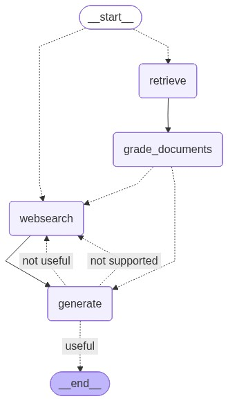
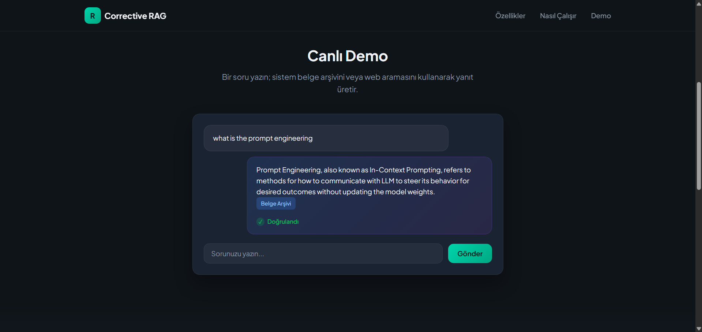
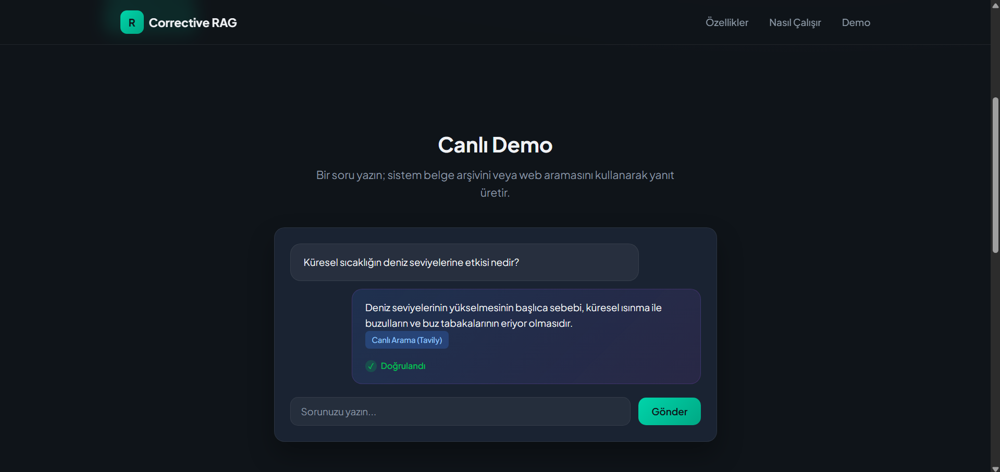
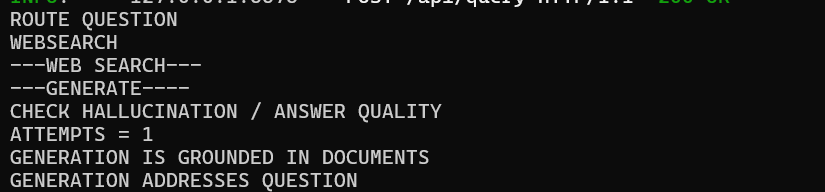

# CorrectiveRAGProject

CorrectiveRAGProject, klasik Retrieval Augmented Generation (RAG) yaklaşımının ötesine geçerek karar veren, kendini denetleyen ve gerektiğinde kendini düzelten bir soru–cevap sistemi kurmayı amaçlar.

Bu projede LLM, yalnızca cevap üreten bir bileşen değil; sistemin farklı aşamalarında değerlendirme yapan bir karar mekanizması olarak kullanılır. Akış, LangGraph ile state-based bir yapı halinde modellenmiştir.

---

GENEL BAKIŞ

Sistem, gelen bir soruyu uçtan uca şu prensiple ele alır:

“En uygun kaynağı seç → bağlamı topla → cevap üret → cevabı denetle → gerekirse geri dön.”

Bu yaklaşım, lineer RAG pipeline’larının aksine kontrollü ve döngüsel bir iş akışı oluşturur.

---

TEMEL ÖZELLİKLER

- Query Routing: Soru, vector store veya web search arasında otomatik olarak yönlendirilir.
- Document Relevance Grading: Retriever’dan gelen dokümanlar filtrelenir.
- Web Search Fallback: Vector store yeterli değilse otomatik web araması yapılır.
- Controlled Generation: LLM yalnızca verilen bağlama dayanarak cevap üretir.
- Self-Check & Correction Loop: Üretilen cevap bağlama ve soruya uygunluk açısından kontrol edilir.
- State-Based Workflow: Akış LangGraph ile state machine olarak modellenmiştir.

---

WORKFLOW GRAFİĞİ

Corrective RAG workflow diyagramı:

---

DEMO & ARAYÜZ

Vector store üzerinden gelen cevap örneği:

Web search fallback ile gelen cevap örneği:

---

HIZLI BAŞLANGIÇ

1. Bağımlılıkları yükleyin

pip install -r requirements.txt

2. Ortam değişkenleri (.env)

OPENAI_API_KEY=your_openai_api_key
TAVILY_API_KEY=your_tavily_api_key

3. Vector store oluşturma

python ingestion.py

4. Sistemi çalıştırma

python main.py

---

PROJE YAPISI

CorrectiveRAGProject/
├── main.py
├── ingestion.py
├── graph/
│   ├── graph.py
│   ├── state.py
│   ├── nodes/
│   └── chains/
├── graph.png
└── requirements.txt

---

NOTLAR

- Proje bağımsız çalışır.
- Döngüsel yapı bounded retries ile kontrol altındadır.
- Amaç en uzun cevabı değil, en güvenilir cevabı üretmektir.
- Detaylı mimari anlatım Medium yazısında https://medium.com/@gamzeyarimkulak/langchain-ile-sistem-odaklı-llm-uygulamaları-aa9d8b430d62  ele alınmıştır.

---

LİSANS

Bu proje eğitim ve öğrenme amaçlıdır.
